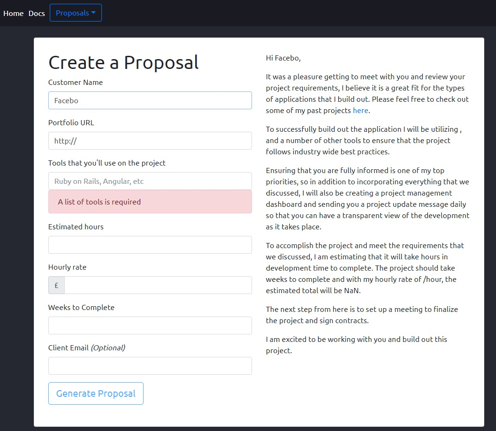

# FreelanceProposalCreator

FreelanceProposalCreator - A mobile responsive website for creating, sending and logging proposals sent to clients.

This web app uses two rails APIs in the backend to provide real-time updates as proposals are created. 

Using two-way binding, the user is able to populate the form on the left and see the text instantly inserted into the document on the right.

### Built with:
* Angular 2
* Rails 5
* Postgres DB
* HTML5
* CSS
* Bootstrap
* Cloud9 IDE (Linux)

### Features include:
* Real-time updates to lists as new documents and proposals are created. See freelance-camp-fe/src/app/proposal/proposal-list.component.ts (line: 24+, ngOnInint())
* Use of interfaces, constructors, services and components to build the front-end. See freelance-camp-fe/src/app (Angular App)
* Validation used to prevent users from generating incomplete proposals. Alerts are used to notify the user.
* Pipes are used to format form entries as they instantly populate the document on the right. See freelance-camp-fe/src/app/proposal/proposal-new.component.ts (line: 50)

### Problems solved:
* Using an alternate IDE to the course instructor, I had to configure it to run Rails and Angular commands in the terminal.
* I then needed to configure the Postgres DB to connect to the app and understand how to start mutliple servers at once in Cloud9.
* Instructor was using Angular 2 while I installed 4. 
* After completing the course, I posted a guide in the Q&A explaining how to set up Angular and Rails in Cloud9.